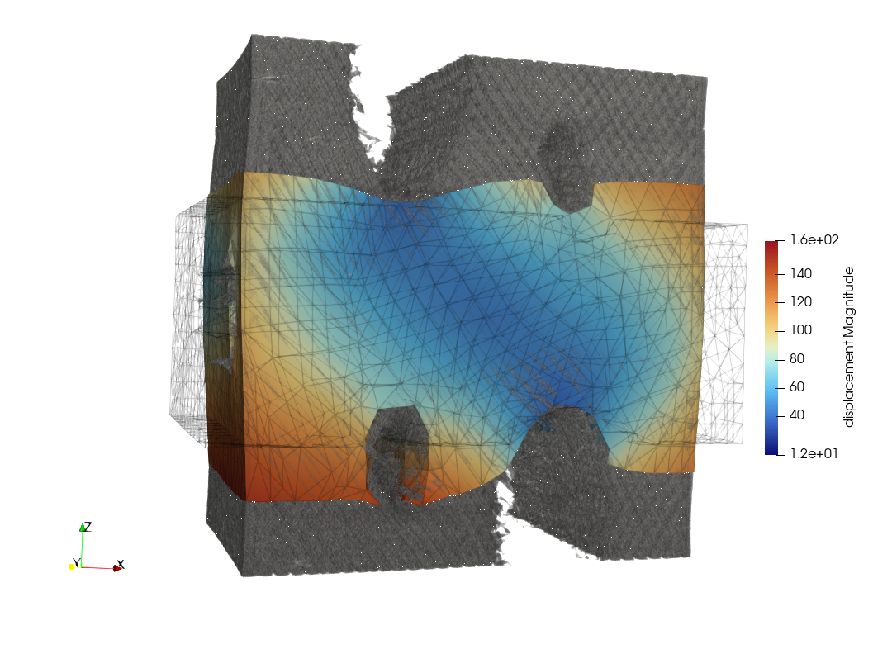

# Experimental learning from 3D data

This folder contains scripts and datasets for analyzing experimental deformation data and training PANN models to predict stress and deformation.

## Contents
- `Main_exp_EUCLID.py`: Script for training and validating PANN models using 3D experimental data.

## Running the Script
```bash
python Main_exp_EUCLID.py
```

## DVC_data

Below is an example DVC data:


