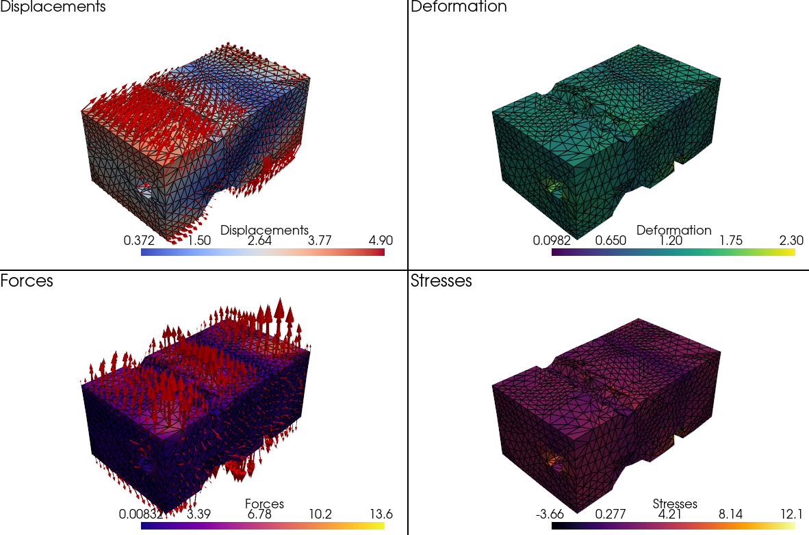

# Physics-Augmented Neural Networks (PANN) for 3D Unsupervised Mechanics

This repository contains code and data for developing and using Physics-Augmented Neural Networks (PANN) aimed at modeling isotropic material behavior under deformation. It integrates TensorFlow neural network models with finite element analysis (FEA) and experimental deformation data.

## Repository Structure
This repo is organized with 3 independent tutorials and a common set of basic methods (PANN_lib).
- `PANN_lib/`: Core Python libraries for FEA functions, PANN and traditional models, mesh generation, and visualization.

Tutorials.
- `tuto_FEA/`: Finite Element Analysis tutorial scripts.
- `tuto_exp/`: Experimental deformation data and scripts for model training and validation.

## Requirements
Requirements may vary on the tutorial. General requirements are:
- Python >= 3.8
- TensorFlow >= 2.0
- NumPy
- Pandas
- PyVista
- gmsh
- matplotlib

## Installation
```bash
pip install tensorflow numpy pandas pyvista gmsh matplotlib
```
or
```bash
conda install tensorflow numpy pandas pyvista gmsh matplotlib
```

## PANN training on 3D experimental data



