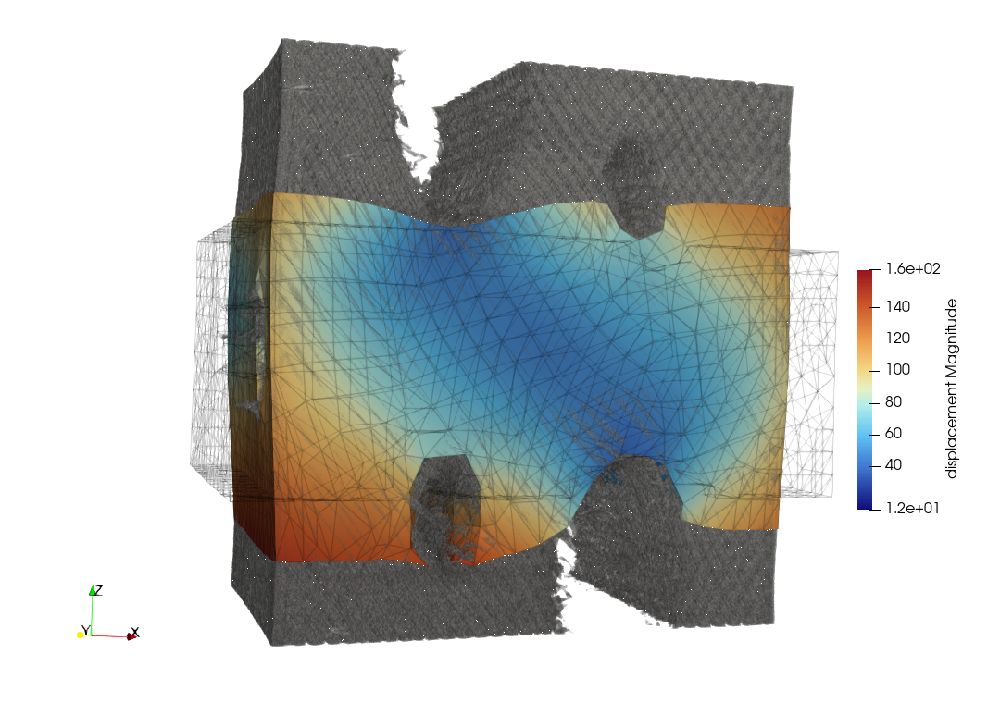
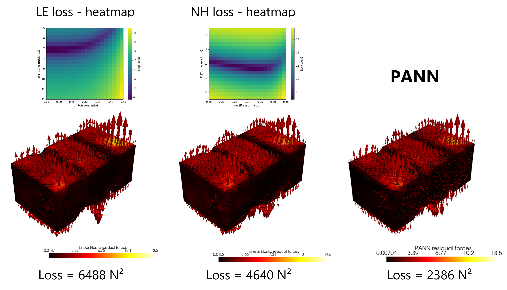

# Experimental Data Analysis Tutorial

This folder contains scripts and datasets for analyzing experimental deformation data and training PANN models to predict stress and deformation.

## Contents
- `Main_exp_EUCLID.py`: Script for training and validating PANN models using experimental data.
- CSV files (`coordinates_scan1.csv`, `connectivity_scan1.csv`, `displacements_scan*.csv`): Experimental datasets.

## Features
- Pre-processing and scaling of experimental data
- Training and validation of linear elastic and Neo-Hookean models
- Visualization and comparison of model predictions

## Running the Script
```bash
python Main_exp_EUCLID.py
```


## DVC_data

Below is an example DVC data:



## Training different models

